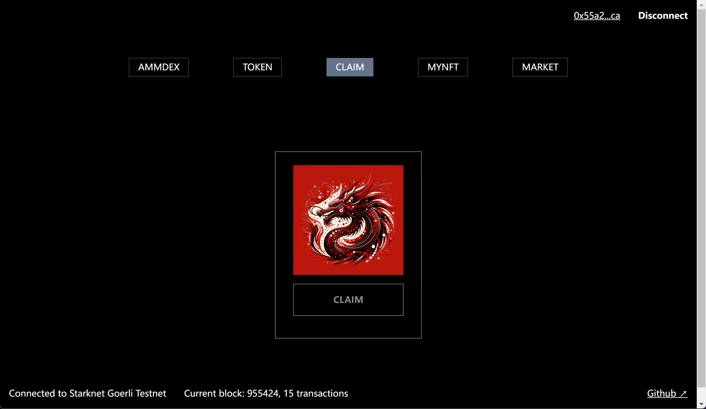
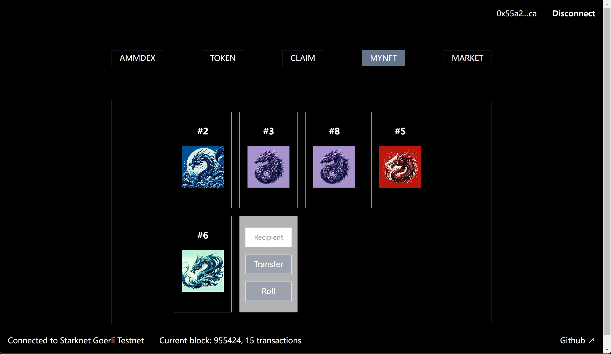
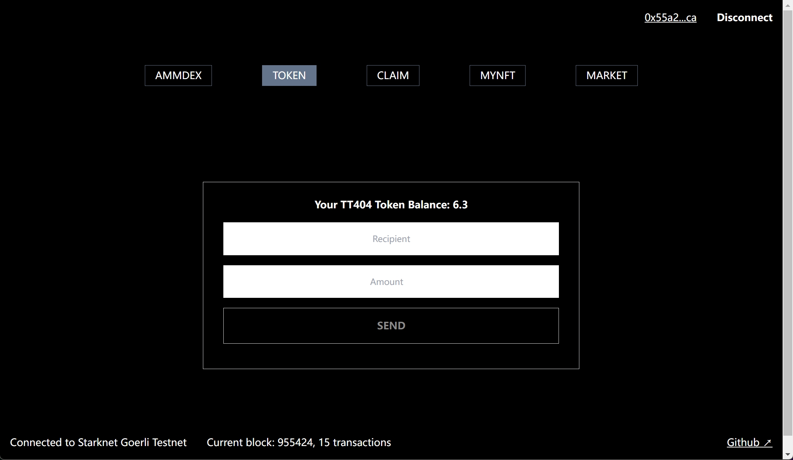

# ERC404 on Starknet

This is a [Starknet erc404 app](https://erc404-cairo-frontend.vercel.app/) project bootstrapped with [`create-next-app`](https://github.com/vercel/next.js/tree/canary/packages/create-next-app) and [starknet-react](https://github.com/apibara/starknet-react).

Frontend fork of [reddio starknet-token-bootstrap](https://github.com/reddio-com/starknet-token-bootstrap)

This is the cairo implementation version of ERC404. And this is a combination of ERC20 and ERC721.
Every time a user reaches 1 unit(1 * 10 ** 18), he owns 1 nft. He can also transfer it like ERC20.
As conclusion, user can swap it in amm dex like ERC20, also user can list or offer it in marketplace like ERC721. 
Enjoy it for free.





## Getting Started

First, clone the repo and install the dependencies:

```sh
git clone git@github.com:yangyaczz/erc404_cairo_frontend.git
```

```sh
cd erc404_cairo_frontend
```

Then, register your Reddio account to get API Key from [Dashboard](https://dashboard.reddio.com/), fill your API Key at .env file,

```javascript
NEXT_PUBLIC_REDDIO_API_KEY="your-reddio-api-key"
```

Finally, run the development server:

```bash
npm run dev
# or
yarn dev
```

Open [http://localhost:3000](http://localhost:3000) with your browser to see the result.
